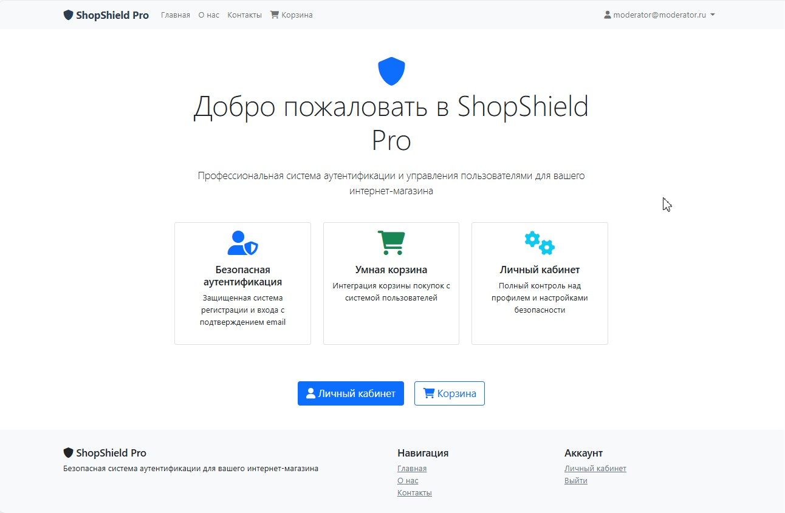
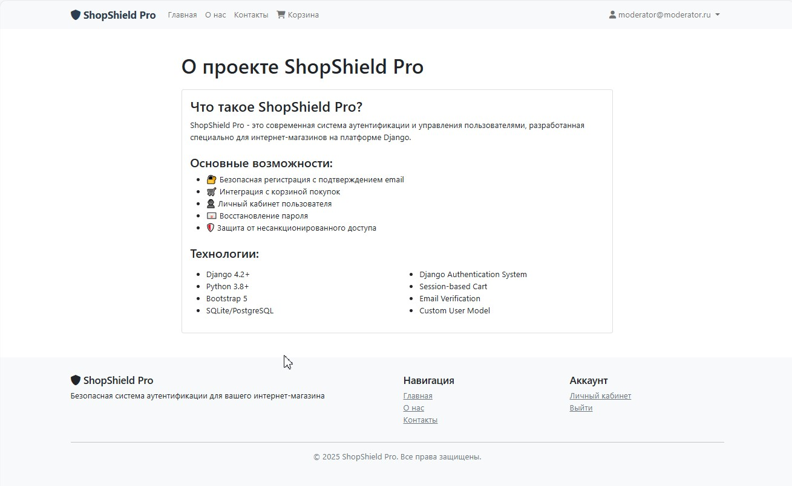
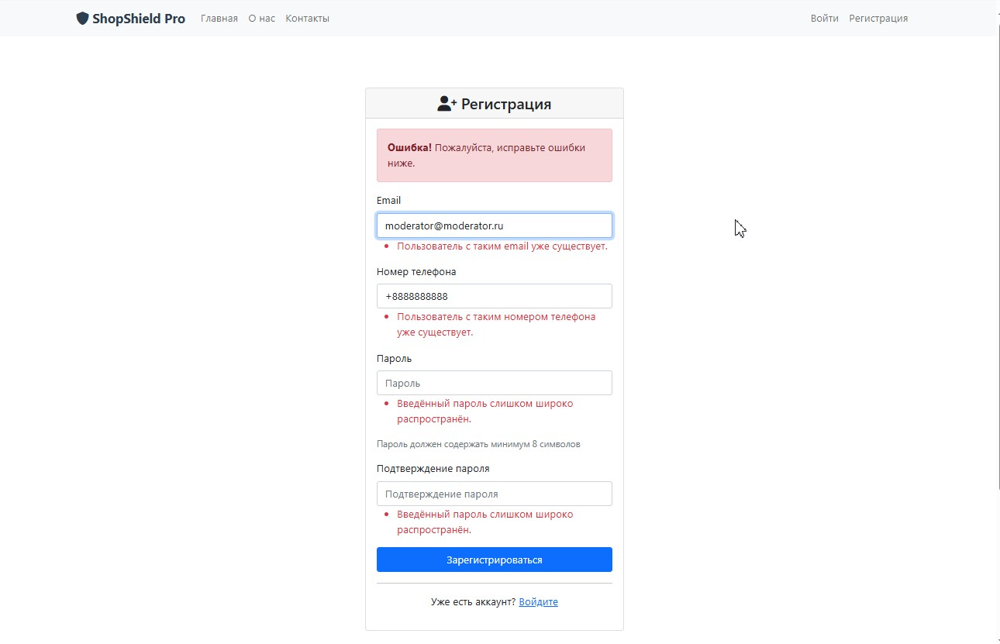
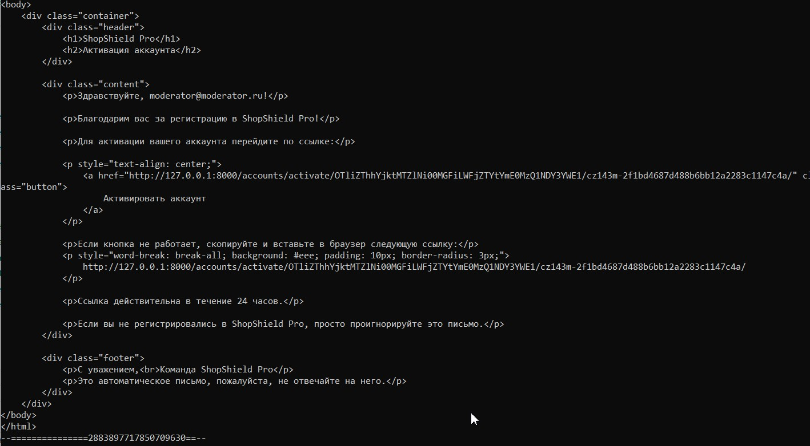
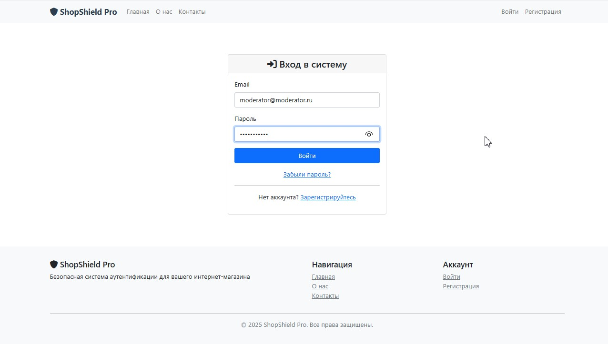
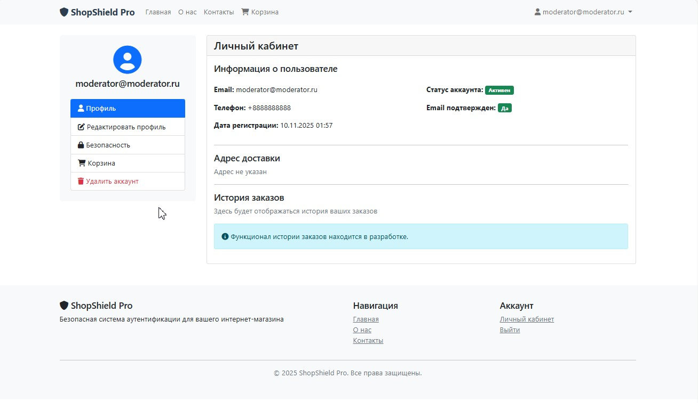
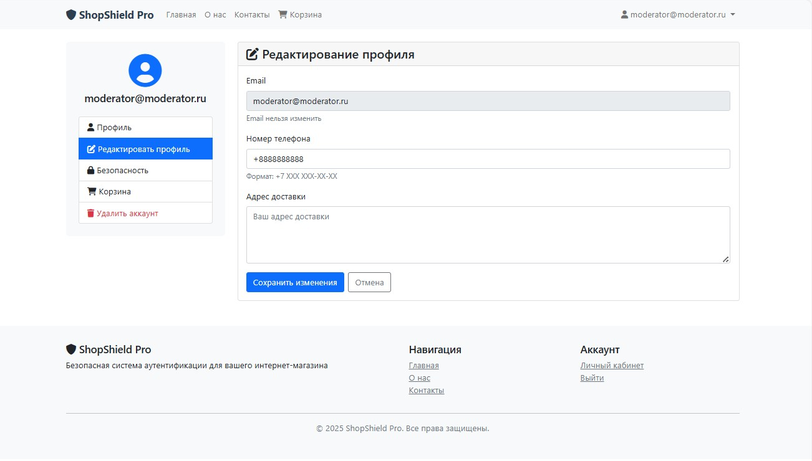
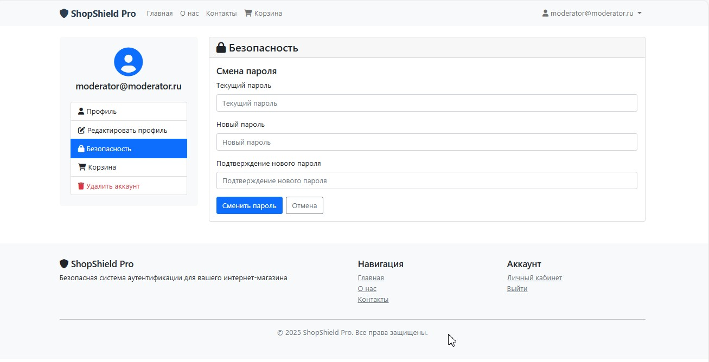
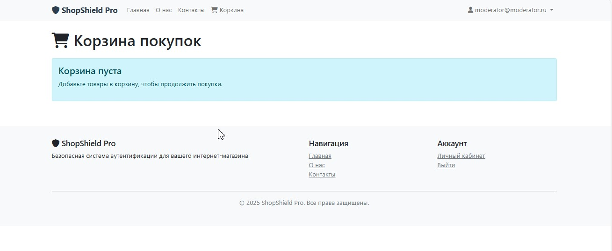

# ShopShield Pro - Система аутентификации для интернет-магазина
<div align="center">


## 📋 Описание
**ShopShield Pro - это полнофункциональная система регистрации и аутентификации, разработанная специально для интернет-магазинов на платформе Django.**

[Описание](#-описание) • [Функциональность](#-функциональность) • [Установка](#-установка) • [Использование](#-использование) 

</div>

## 📸 Демонстрация проекта

### 📱 Главная страница

*Главная страница с навигацией*

### 📱 О нас

*Информация о проекте*

### 👤 Регистрация

*Форма регистрации*

### 👤 Подтверждение регистрации

*Подтверждение регистрации по ссылке*

### 🔐 Вход в систему

*Страница авторизации*

### ✉️ Личный кабинет

*Личный кабинет пользователя*

### 📊 Редактирование профиля

*Редактирование данных профиля*

### 📊 Смена пароля

*Смена пароля*

### 📊 Корзина покупателя

*Страница покупок*

## 🎯 Функциональность

### 🔐 Система аутентификации
- Кастомная модель пользователя с расширенными полями
- Регистрация с подтверждением email
- Безопасный вход только после подтверждения email
- Восстановление пароля через email
- Личный кабинет с управлением профилем

### 🛒 Интеграция с корзиной
- Сессионная корзина для анонимных пользователей
- Перенос корзины при авторизации
- Управление товарами в корзине
- Сохранение состояния между сессиями

### 👤 Управление профилем
- Редактирование личных данных (телефон, адрес)
- Смена пароля с проверкой безопасности
- Безопасное удаление аккаунта
- История заказов (заготовка под будущий функционал)

## 🚀 Технологический стек
### 🎨 Frontend
https://img.shields.io/badge/Bootstrap-5.1-7952B3?logo=bootstrap&logoColor=white
https://img.shields.io/badge/Font_Awesome-6.0-339AF0?logo=fontawesome&logoColor=white
https://img.shields.io/badge/HTML5-E34F26?logo=html5&logoColor=white
https://img.shields.io/badge/CSS3-1572B6?logo=css3&logoColor=white

### ⚙️ Backend
https://img.shields.io/badge/Django-4.2.26-092E20?logo=django&logoColor=white
https://img.shields.io/badge/Python-3.12-3776AB?logo=python&logoColor=white
https://img.shields.io/badge/SQLite-07405E?logo=sqlite&logoColor=white

### 🔧 Дополнительные компоненты
https://img.shields.io/badge/Django_Auth-%E2%9C%93-green
https://img.shields.io/badge/Email_Backend-Console/File-blue
https://img.shields.io/badge/Session_Management-%E2%9C%93-orange

## ⚙️ Установка

### 1. Клонирование и настройка
```
bash
git clone <repository-url>
cd ShopShield_Pro
python -m venv venv
source venv/bin/activate  # Linux/Mac
 venv\Scripts\activate   # Windows
```
### 2. Установка зависимостей
```
bash
pip install django
```
### 3. Настройка базы данных
```
bash
python manage.py makemigrations
python manage.py migrate
```
### 4. Создание суперпользователя
```
python manage.py createsuperuser
```
### 5. Запуск сервера
```
bash
python manage.py runserver
```
## 🎮 Использование
### 🔧 Административная панель
-Доступ:```http://127.0.0.1:8000/admin/```
-Управление пользователями и корзинами

### 👥 Пользовательские функции
- **Регистрация:** ```http://127.0.0.1:8000/accounts/register/```
- **Вход:** ```http://127.0.0.1:8000/accounts/login/```
- **Профиль:** ```http://127.0.0.1:8000/accounts/profile/```
- **Корзина:** ```http://127.0.0.1:8000/cart/```

### 🔒 Безопасность
- **Подтверждение email** перед активацией аккаунта
- **Хеширование паролей** с использованием Django auth
- **CSRF защита** всех форм
- **Валидация данных** на стороне сервера и клиента
- **Сессионное управление** с настройкой времени жизни

### 🛠️ Кастомные модели
#### Пользователь (CustomUser)
```
python
class CustomUser(AbstractBaseUser):
    email = models.EmailField(unique=True)
    phone_number = models.CharField(max_length=20)
    address = models.TextField()
    is_active = models.BooleanField(default=False)
    is_verified = models.BooleanField(default=False)
```
#### Корзина (Cart)
```
python
class Cart(models.Model):
    user = models.OneToOneField(CustomUser)
    items = models.ManyToManyField(CartItem)
    created_at = models.DateTimeField(auto_now_add=True)
```
#### 📧 Email система
**Режимы работы** 
- **Разработка:**  Письма выводятся в консоль
- **Продакшн:** Настройка SMTP сервера

**Шаблоны email** 
- Активация аккаунта
- Восстановление пароля
- HTML и текстовые версии

## 🚀 Возможности расширения
- Интеграция с платежными системами
- Система уведомлений
- Two-Factor Authentication (2FA)
- OAuth авторизация
- REST API
- Модуль отзывов и рейтингов

## 👥 Разработчики
ShopShield Pro разработан для демонстрации возможностей Django в создании систем аутентификации для e-commerce.

## 📄 Лицензия
Этот проект лицензирован под MIT License - смотрите файл LICENSE для деталей.

<div align="center">
⭐ Если проект был полезен, поставьте звезду на GitHub!

</div>
